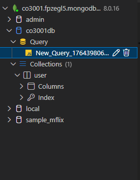
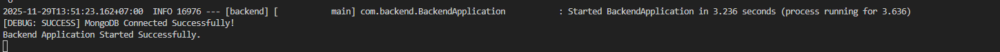

# Backend - CO3001 Assignment

## Yêu cầu hệ thống

### Java 21
Dự án này yêu cầu **Java 21** trở lên để chạy.

#### Cách tải Java 21
1. Truy cập [Oracle Java SE Downloads](https://www.oracle.com/java/technologies/downloads/#java21) hoặc [OpenJDK](https://jdk.java.net/21/)
2. Tải xuống Java Development Kit (JDK) 21 phù hợp với hệ điều hành của bạn
3. Cài đặt JDK theo hướng dẫn của installer
4. Kiểm tra cài đặt bằng cách chạy lệnh:
   ```bash
   java -version
   ```
   Kết quả nên hiển thị phiên bản 21 hoặc cao hơn

### MongoDB
Dự án này sử dụng **MongoDB** làm cơ sở dữ liệu chính.

#### Quản lí Database với Database Client
1. Truy cập [https://marketplace.visualstudio.com/items?itemName=cweijan.vscode-mysql-client2](https://marketplace.visualstudio.com/items?itemName=cweijan.vscode-mysql-client2)
2. Ctrl + Shift + P -> Database Client: Add Connection
3. Chọn MongoDB và Use Connection String:
    ```
    mongodb+srv://---
    ```


4. Kết nối và quản lí database dễ dàng qua giao diện người dùng của Database Client



## Cấu trúc dự án (Feature-Based Architecture)

Dự án được tổ chức theo kiến trúc dựa trên tính năng (Feature-Based), giúp dễ bảo trì và phát triển.

Mỗi Feature có cấu trúc thư mục riêng bao gồm các thành phần như controller, service, repository, dto, entity, và mapper.

### Cây thư mục

```
src/main/java/com/backend/
├── BackendApplication.java          # Điểm khởi động ứng dụng
├── common/                          # Mã dùng chung cho tất cả các tính năng
├── features/
│   ├── auth/                        # Tính năng xác thực & phép cấp
│   ├── course/                      # Tính năng quản lý khóa học
│   ├── feedback/                    # Tính năng phản hồi
│   └── user/                        # Tính năng quản lý người dùng
│       ├── controller/              # REST API endpoints
│       ├── service/                 # Business logic
│       ├── repository/              # Database access (JPA)
│       ├── dto/                     # Data Transfer Objects
│       ├── entity/                  # JPA entities
│       └── mapper/                  # Chuyển đổi dữ liệu
└── resources/
    └── application.yaml             # Cấu hình ứng dụng
```


### Chạy ứng dụng
#### Cách 1: VSode
1. Mở thư mục dự án trong VSCode
2. Mở file `BackendApplication.java`
3. Nhấn chuột phải vào bên trong file và chọn "Run Java"

** Đảm bảo tải các extension cần thiết cho Java và Spring Boot trong VSCode để hỗ trợ chạy ứng dụng. **
